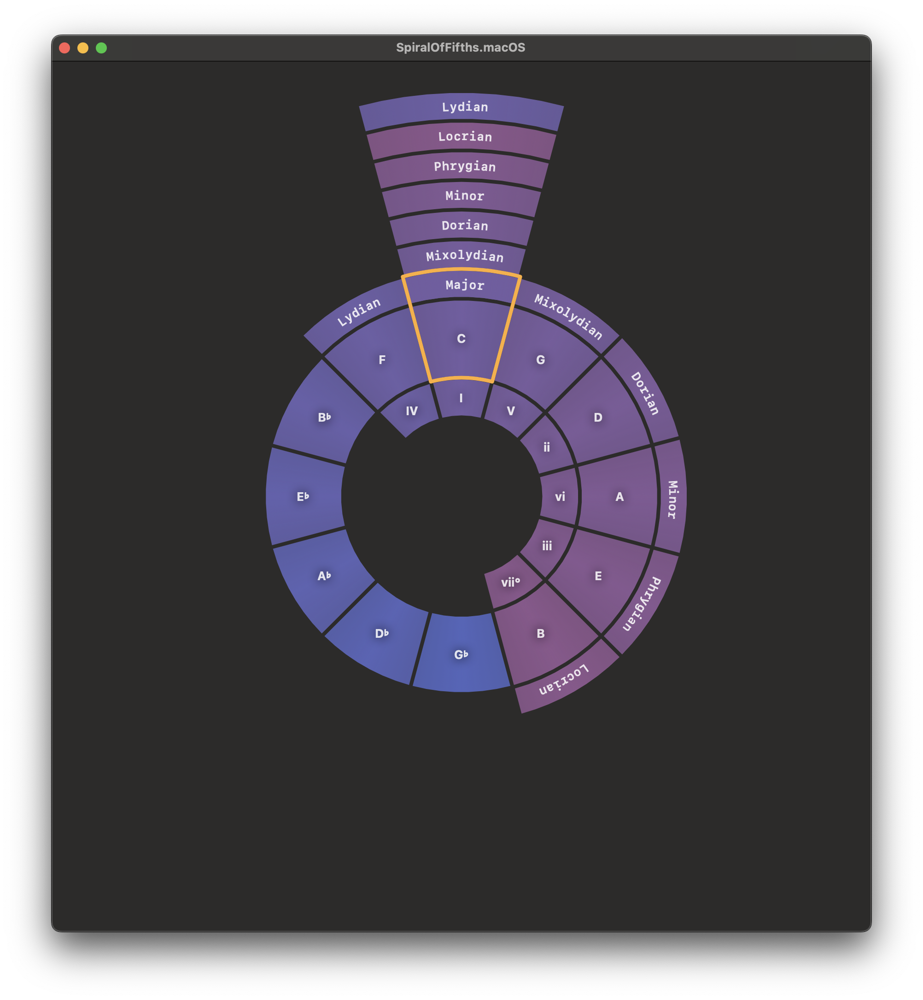
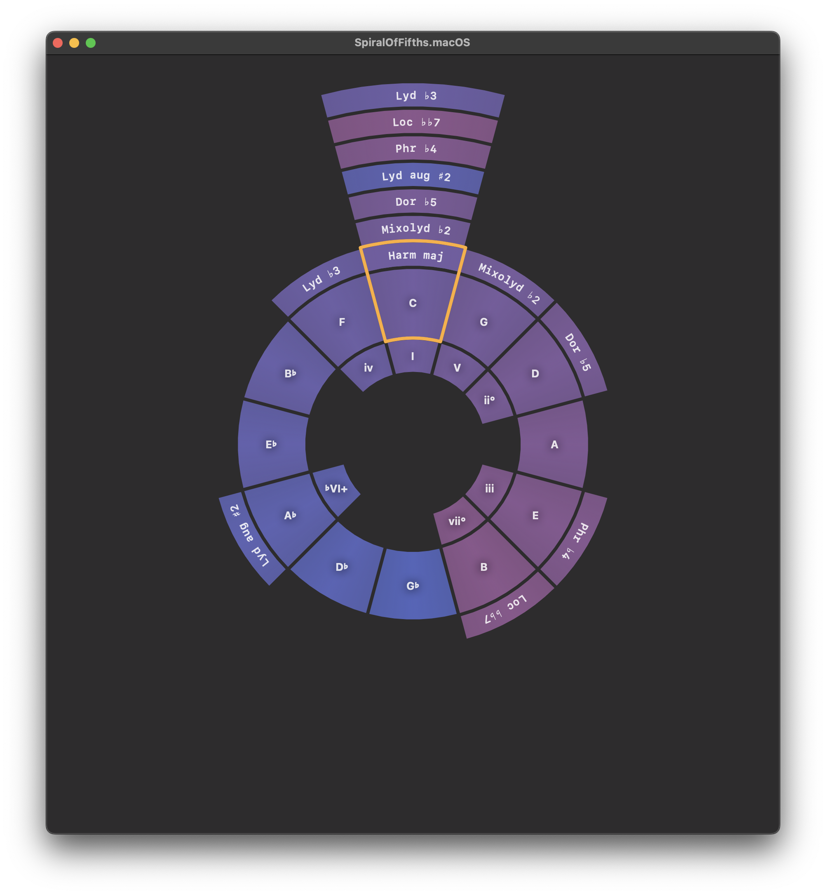

# SwiftMusicTheory

Open source Swift representation of music theory made to be as accurate as possible. This library aims to make working with music theory easier and more intuitive. 
# **Features**
This library provides an easy-to-use interfaces for developers to integrate music theory into their Swift applications. These features provide a robust foundation for working with music theory concepts in Swift, enabling both beginners and experts to explore and utilize music theory programmatically.

## **Notes**: 
- Define and manipulate musical notes with ease.
``` swift
let c: Note = .c
let dFlat = c + .second(.minor)
let d = c + .second(.major)

#expect("\(c.sharp().sharp())" == "C♯♯")
#expect("\(Note.g.flat())" == "G♭")
```

- Calculate enharmonisms: 
``` swift
let e: Note = .f.flat().diatonicEnharmonism(shifted: -1)
```

- Combine with Octave and cents shift to get Pitch (MIDI support coming soon):
```swift
public extension Note {
  func octave(_ octave: Octave) -> Pitch {
    Pitch(note: self, octave: octave)
  }
}

public enum Octave: Int, CaseIterable {
  case subcontra = 0
  case contra = 1
  case great
  case small
  case oneLine
  case twoLine
  case threeLine
  case fourLine
  case fiveLine
  case sixLine
}
```
## **Intervals**
- Define intervals with  `public init(diatonicIndex: Interval.Number, semitones: Int)` or use static properties of Interval
```swift
print(Interval(diatonicIndex: 2, semitones: 2)) // Prints "major second"
print(Interval.third(.diminished(times: 2)).shortTitle) // Prints "dd3"
```

- Transpose notes with  `func transposed(by interval: Interval, direction: VerticalDirection = .up) -> Note ` or just use `+` and `-` operators:
```swift
#expect(Note.a.flat() + .sixth(.minor) == .f.flat())
```
- Sum intervals
```swift
#expect(.second(.major) + .third(.major) == .fourth(.augmented()))
```
- Distinct perfect/imperfect and simple/compound Intervals
```swift
public enum Interval: Sendable {
  case perfect(Perfect, Perfect.Quality, octaves: Int = 0)
  case imperfect(Imperfect, Imperfect.Quality, octaves: Int = 0)
}
```
- Inverse intervals:
```swift
#expect(.second(.major).inverted == .seventh(.minor))
#expect(.fifth(.augmented()).inverted == .fourth(.diminished()))
```

## **Scales and Modes**:
- Support for various predefined scales:
	- Natural major (Diatonic)
	- Harmonic major
	- Double harmonic major
	- Harmonic minor
	- Melodic minor
	- Pentatonic
	- Whole tone
	- Diminished
	- Augmented
- Easily define your own scale
``` swift
Scale(
    name: "Diatonic",
    steps: [
      Step(.second(.major), "Major"),
      Step(.second(.major), "Dorian"),
      Step(.second(.minor), "Phrygian"),
      Step(.second(.major), "Lydian"),
      Step(.second(.major), "Mixolydian"),
      Step(.second(.major), "Minor"),
      Step(.second(.minor), "Locrian")
    ]
  )
```

### Easily calculate:
- Scale modes formulas
```swift
#expect(
  diatonic.mode(at: 6).formula ==
  [.second(.major), .second(.minor), .second(.major), .second(.major), .second(.minor), .second(.major), .second(.major)]
)
```

- Scale degrees compared to diatonic or to specified scale:
```swift
#expect(diatonic.degrees() == [.tonic(), .second(), .third(), .fourth(), .fifth(), .sixth(), .seventh()])
#expect(diatonic.mode(at: 6).degrees() == [.tonic(), .second(), .third(.flat), .fourth(), .fifth(), .sixth(.flat), .seventh(.flat)])

#expect(diatonic.degrees(comparedTo: .diatonic.mode(at: 6)) == [.tonic(), .second(), .third(.sharp), .fourth(), .fifth(), .sixth(.sharp), .seventh(.sharp)])
```

- All triads in the scale or its modes
```swift
#expect(Scale.diatonic.triads == [.major, .minor, .minor, .major, .major, .minor, .diminished])
#expect(Scale.diatonic.mode(at: 6).triads == [.minor, .diminished, .major, .minor, .minor, .major, .major])
```

- Parallel and relative modes
```swift
let cMajor = Mode(root: .c, scale: .diatonic)
print(cMajor.parallelMode(at: 6)) // Prints "C Minor"
print(cMajor.relativeMode(at: 6)) // Prints "A Minor"
```

- All notes in the given mode
```swift
let cWholeTone = Mode(root: .c, scale: .wholeTone)
#expect(cWholeTone.notes == [.c, .d, .e, .f.sharp(), .g.sharp(), .a.sharp()])
#expect(cWholeTone.relativeMode(at: .e)?.notes == [.e, .f.sharp(), .g.sharp(), .a.sharp(), .c, .d])
#expect(cWholeTone.parallelMode(at: 2).notes == [.c, .d, .e, .f.sharp(), .g.sharp(), .b.flat()])
```

- If you ever wondered why you will ever need double (or triple) sharps, you can meditate on this block of code :)
```swift
let bSharpWholeTone = Mode(root: .b.sharp(), scale: .wholeTone)
#expect(bSharpWholeTone.notes == [.b.sharp(), .c.sharp(2), .d.sharp(2), .e.sharp(2), .f.sharp(3), .g.sharp(3)])
```

##  **Utilities**
- Handy functions for common music theory tasks and calculations.
```swift
extension Pitch {
  public var scientificNotation: String {
    String(note.notation) + String(octave.rawValue)
  }
  
  public static let distanceReduction: CGFloat = pow(2, -(1.0 / Double(Interval.octave().semitonesCount())))
```

# **Tests**
A lot of tests can be found at Tests/ folder written on new [Swift Testing](https://github.com/apple/swift-testing) library
Feel free to explore them for better understanding of the main concepts in the music theory

# **Roadmap**
- [ ] Chords inversions detection
- [ ] MIDI support
- [ ] Microtonal systems support


# **Usage**
We use the library in a bunch of our internal apps, that are currently on its way to the AppStore. Stay tuned for more!
- Spiral of Fifths - a better representation of Circle of Fifths concept made for interactive navigationing throu modes of basic scales, such as Diatonic, Harmonic major, Pentatonic, Whole tone, Diminished and more.  Follow our telegram for more
   
- Oscillations - engaging, effective, and accessible platform for music enthusiasts of all levels to improve technical and theoretical skills build for iOS, macOS and visionOS.
- Bunch of utilities, such as Metronome, Tuner, Chord detectors and so on

# **Acknowledgements**
Feel free to let us know if there’s anything specific you’d like to add or modify! And feel free to contribute, I'll be glad to see your Pull Requests :)
For any questions or suggestions, please contact us at waves.tech.labs@gmail.com
